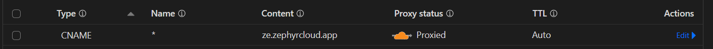

import { Button } from '@zephyr-docs/shared';
import { Steps, Badge } from '@rspress/core/theme';
import { Separator } from '@zephyr-docs/shared';
import { CustomDomain } from '../../components/cloud-provider.tsx';

# Configure Cloudflare on Zephyr

Originally launched as an email spam tracker, Cloudflare today offers extensive capabilities for users to register, manage domains as a registrar, and monitor, secure, and configure an entire IT infrastructure.

In this guide, we'll walk you through configuring Cloudflare as your default cloud provider for deploying and versioning applications with Zephyr Cloud. This setup leverages Cloudflare's global edge network, KV namespaces, Workers, and Pages to deliver your content at the edge.

## Prerequisites

:::info

- A registered Cloudflare account
- A domain registered on Cloudflare, or a domain whose DNS can be managed by Cloudflare
- A registered Zephyr Account

:::

## Configure and Enable Cloudflare

<Steps>
### Log in to the Zephyr Dashboard
<a href="https://app.zephyr-cloud.io">
<Button variant="outline" className="hover:bg-zinc-100 hover:text-black">Dashboard</Button>
</a>
After signing in, select your organization.
 

### Locate Cloudflare under Deployment Integration

- Select **Settings** from the top navigation tabs.
- On the left sidebar, select **Deployment Integration**.
- Choose **Available** to find Cloudflare, then click on **Add integration**.

### Retrieve Credentials and Configure Cloudflare

Before proceeding, you will need two details and one DNS configuration from Cloudflare:

#### 1. Zone ID

- On your domain’s **Overview** tab, scroll down to the **API** section on the right sidebar.
- Find the **Zone ID** in this section.

#### 2. API Token

- Near Zone ID and Account ID, _right-click_ on **Get your API token** to _open it in a new tab_.
- Scroll to the bottom and select **Create Custom Token** by clicking on "Get started."
- Give your API token a meaningful name (e.g., the purpose or creator).
- Configure the required **Permissions**:

| Resource |   Resource Type   | Permission |
| :------- | :---------------: | :--------: |
| Account  | Worker KV Storage |    Edit    |
| Account  |  Worker Scripts   |    Edit    |
| Account  | Cloudflare Pages  |    Edit    |
| Zone     |   Worker Routes   |    Edit    |

#### 3. Zone Resources: When prompted, include a Specific zone under your domain

- Leave other configurations (e.g., Account resources, Client IP Address Filtering) as defaults.
- Scroll to the bottom and select **Continue to summary** to review your configurations, then **Create Token**. The token will display on the next page.

#### 4. Configure Your DNS Record

- Return to your domain’s home page (the **Overview** page should still be open) and click on **DNS** on the left sidebar.
- Click **Add record** on the _Records_ page and enter the following details:

Click to view DNS record details

| Type  | Name |       Content        | Proxy Status | TTL  |
| :---: | :--: | :------------------: | :----------: | :--: |
| CNAME | `*`  | `ze.zephyrcloud.app` |   Proxied    | Auto |

#### 5. Configure advanced certificate (optional: required if you want to use domains like `*.ze.your.domain`)

- Go to **SSL/TLS** page and view **Edge Certificates**
- Click on Purchase ACM and complete buying
- Order/configure advanced certificate and add `*.ze.your.domain` into Certificate Hostnames, so complete list should look like `your.domain *.your.domain *.ze.your.domain`

### Configuration Inputs

Details for each input after clicking **Add Integration** under **Cloudflare**:

<dt>Integration Name</dt>
<dd>A unique name within your organization, used as a slug.</dd>

<dt>Integration Display Name</dt>
<dd>The name of the integration shown on the dashboard.</dd>

<dt>Delimiter</dt>
<dd>Choose the delimiter for application subdomains: `-` (your deploy URL will be `*-ze.your.domain`) or `.` (your deploy URL will be `*.ze.your.domain`) </dd>

<dt>API Token</dt>
<dd>
  Obtainable from Cloudflare. [See
  instructions](#2-api-token) for creating
  your API token.
</dd>

<dt>Zone ID</dt>
<dd>Obtainable from Cloudflare. Requires a valid domain on Cloudflare.</dd>

<dt>Cloudflare Project Name</dt>
<dd>
  This operation is idempotent and will create a [Cloudflare Pages
  project](https://developers.cloudflare.com/pages). This field will become the
  name of your Cloudflare Pages project.
</dd>

<dt>Set Integration as Default</dt>
<dd>
  When set as default, all Zephyr deployments will use this integration until a
  new one (default integration) is set.
</dd>

 
 

</Steps>

### Testing Cloudflare Integration

Visit our [recipes](/recipes) to test an application. Your next deployment should use your designated domain! (If not, [talk to us on Discord](https://zephyr-cloud.io/discord)).

When using our managed cloud (Cloudflare) or custom Cloudflare integration, avoid including capital letters in names for `package.json`, module federation configuration, or assets to prevent issues with Cloudflare queries.

## Troubleshooting

### What Will Be Created on Your Cloudflare Account?

When Cloudflare is added as your provider on Zephyr, these properties will be created on your Cloudflare account:

#### 1. KV Namespaces

Three namespaces will be added:

- ze_snapshots
- ze_files
- ze_env

#### 2. Workers

- `ze-worker-for-static-upload` (for uploading and serving assets)

#### 3. Worker Routes

- `ze.<domain.com>/*` on worker `ze-worker-for-static-upload`
- `*-ze.<domain.com>/*` on worker `ze-worker-for-static-upload`

#### 4. DNS Records

A CNAME record will be added to your domain with the following details:

| Type  | Name |       Content        | Proxy Status | TTL  |
| :---: | :--: | :------------------: | :----------: | :--: |
| CNAME | `*`  | `ze.zephyrcloud.app` |  ✔ Proxied   | Auto |

### Deployment and Inspecting Assets

Once your first Cloudflare deployment is complete, you can inspect assets.

In your Cloudflare dashboard, navigate to **Workers & Pages** and then **KV** to view assets under `ze_files`.

:::info

- `ze_files`: stores your actual assets.
- `ze_envs`: stores application environment and access rights.
- `ze_snapshot`: stores application snapshots compared against the previous build.
- If deploying an application previously on our managed cloud, run `rm -rf ~/.zephyr` before deployment.
- If you encounter issues deploying Micro-frontend applications, see our [Micro-frontend deployment guide](/how-to/mf-guide).

:::

## Clean Uninstall and Reset

:::danger Warning

- Zephyr Cloud does not manage deletion of API tokens or any Cloudflare account properties.
- Assets and information on your Cloudflare account are immutable by default. During a **clean uninstall**, previously deployed assets and information are unrecoverable.

:::

To delete an existing Cloudflare integration, follow these steps:

### Delete Workers & Pages Projects

1. Sign in to Cloudflare. In the navigation bar, select **Workers & Pages**.

2. Click on **ze-worker-for-static-upload**, select **Manage**, then click **Delete**.

3. Return to **Workers & Pages** and locate these two properties:

- **Cloudflare integration name**: created under **Cloudflare Project Name** on the Zephyr dashboard.
- **ze-worker-for-static-upload**: created by Zephyr when integration was added.

Select both projects, choose **Manage**, and click **Delete**.

### Delete KV Namespace

1. In **Workers & Pages**, select **KV**.

2. Locate and delete the following namespaces:

- ze_envs
- ze_snapshots
- ze_files

### Delete Worker Routes

1. On the dashboard, select the **domain** used for Deployment integration.

2. Choose **Workers Routes** in the navigation bar. Locate routes with `ze` and `*-ze` prefixes, then select **Edit** and **Remove**.

### Delete Deployment Integration

1. Log into Zephyr, select the organization with the integration to delete.

2. Go to **Settings** in the organization dashboard, choose **Deployment Integration**.

3. Select the integration name and click **Remove**.

## What’s Next?

<CustomDomain />
