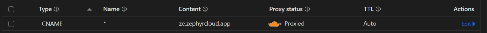
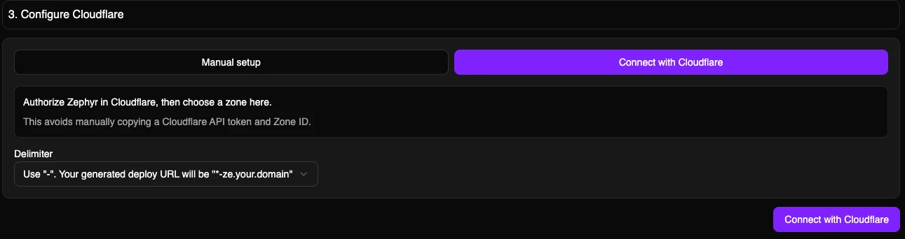
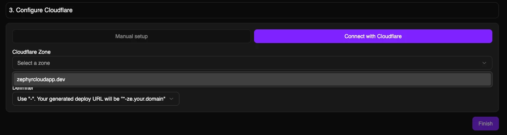
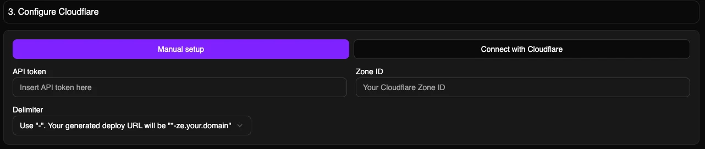
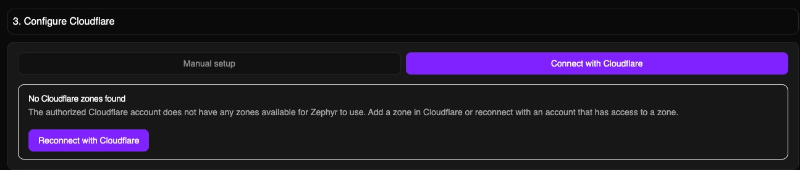

import { Button } from '../../components/ui/button.tsx';
import { Steps, Badge } from '@rspress/core/theme';
import { Separator } from '../../components/ui/separator.tsx';
import { CustomDomain } from '../../components/cloud-provider.tsx';

# Configure Cloudflare on Zephyr

Originally launched as an email spam tracker, Cloudflare today offers extensive capabilities for users to register, manage domains as a registrar, and monitor, secure, and configure an entire IT infrastructure.

In this guide, we'll walk you through configuring Cloudflare as your default cloud provider for deploying and versioning applications with Zephyr Cloud. This setup leverages Cloudflare's global edge network, KV namespaces, Workers, and Pages to deliver your content at the edge.

## Prerequisites

:::info

- A registered Cloudflare account
- A domain registered on Cloudflare, or a domain whose DNS can be managed by Cloudflare
- A registered Zephyr Account

:::

## SSR Worker (beta)

:::warning Availability

Zephyr’s **SSR Worker** runtime is currently **beta** and **only available on Cloudflare** using **Zephyr’s default (managed) Cloudflare integration**.

It is **not available** on Bring Your Own Cloud (BYOC) deployments (including custom/non-default integrations).

If you need SSR support on another integration or deployment target, send us a DM on **[Discord](https://discord.gg/zephyrcloud)**.

Learn more: **[SSR Worker (beta)](/reference/ssr-worker)**.  
Using TanStack Start? See: **[TanStack Start](/meta-frameworks/tanstack-start)**.

:::

## Configure and Enable Cloudflare

<Steps>
### Log in to the Zephyr Dashboard
<a href="https://app.zephyr-cloud.io">
<Button variant="outline" className="hover:bg-zinc-100 hover:text-black">Dashboard</Button>
</a>
After signing in, select your organization.
 

### Locate Cloudflare under Deployment Integration

- Select **Settings** from the top navigation tabs.
- On the left sidebar, select **Deployment Integration**.
- Choose **Available** to find Cloudflare, then click on **Add integration**.

### Configure Your DNS Record

- Return to your domain’s home page (the **Overview** page should still be open) and click on **DNS** on the left sidebar.
- Click **Add record** on the _Records_ page and enter the following details:

Click to view DNS record details

| Type  | Name |       Content        | Proxy Status | TTL  |
| :---: | :--: | :------------------: | :----------: | :--: |
| CNAME | `*`  | `ze.zephyrcloud.app` |   Proxied    | Auto |

### Connect with Cloudflare (recommended)

Zephyr Cloud now supports Cloudflare OAuth for deployment integrations. This is the recommended setup path because you authorize Zephyr in Cloudflare instead of manually copying a Cloudflare API token and Zone ID into Zephyr.

After completing **Basic Info** and confirming the DNS record:

- In **Configure Cloudflare**, choose **Connect with Cloudflare**.
- Click **Connect with Cloudflare**.
- In Cloudflare, select the Cloudflare account that owns the zone you want Zephyr to use.
- Review the requested permissions, then select **Authorize**.
- After Cloudflare redirects back to Zephyr, wait for Zephyr to load your Cloudflare zones.
- Select the **Cloudflare Zone** for this integration.
- Choose the delimiter for generated deployment URLs.
- Click **Finish**.

:::info

Cloudflare shows the application name, publisher domain, account selection, and requested permissions before you authorize. Zephyr completes the OAuth exchange server-side, so Cloudflare access and refresh tokens are not exposed in your browser.

You can review or revoke authorized OAuth applications from your Cloudflare profile. Cloudflare account administrators can also restrict public OAuth application access for their account. See Cloudflare's [Authorizing an application](https://developers.cloudflare.com/fundamentals/oauth/authorizing-an-application/) guide for details.

:::

### Manual API token setup

Manual setup remains available if OAuth is unavailable for your account, blocked by your Cloudflare account settings, or your organization requires manually managed Cloudflare API tokens.

For manual setup, you will need your Cloudflare **Zone ID** and an **API Token**.

#### 1. Zone ID

- On your domain’s **Overview** tab, scroll down to the **API** section on the right sidebar.
- Find the **Zone ID** in this section.

#### 2. API Token

- Near Zone ID and Account ID, _right-click_ on **Get your API token** to _open it in a new tab_.
- Scroll to the bottom and select **Create Custom Token** by clicking on "Get started."
- Give your API token a meaningful name (e.g., the purpose or creator).
- Configure the required **Permissions**:

| Resource |   Resource Type   | Permission |
| :------- | :---------------: | :--------: |
| Account  | Worker KV Storage |    Edit    |
| Account  |  Worker Scripts   |    Edit    |
| Account  | Cloudflare Pages  |    Edit    |
| Zone     |   Worker Routes   |    Edit    |

#### 3. Zone Resources: When prompted, include a Specific zone under your domain

- Leave other configurations (e.g., Account resources, Client IP Address Filtering) as defaults.
- Scroll to the bottom and select **Continue to summary** to review your configurations, then **Create Token**. The token will display on the next page.

#### 4. Configure advanced certificate (optional: required if you want to use domains like `*.ze.your.domain`)

- Go to **SSL/TLS** page and view **Edge Certificates**
- Click on Purchase ACM and complete buying
- Order/configure advanced certificate and add `*.ze.your.domain` into Certificate Hostnames, so complete list should look like `your.domain *.your.domain *.ze.your.domain`

### Configuration Inputs

Details for each input after clicking **Add Integration** under **Cloudflare**:

<dt>Setup Method</dt>
<dd>
  Choose **Connect with Cloudflare** for OAuth setup, or **Manual setup** to
  paste a Cloudflare API token and Zone ID.
</dd>

<dt>Integration Name</dt>
<dd>A unique name within your organization, used as a slug.</dd>

<dt>Integration Display Name</dt>
<dd>The name of the integration shown on the dashboard.</dd>

<dt>Delimiter</dt>
<dd>
  Choose the delimiter for application subdomains: `-` (your deploy URL will be
  `*-ze.your.domain`) or `.` (your deploy URL will be `*.ze.your.domain`){' '}
</dd>

<dt>API Token</dt>
<dd>
  Required only for **Manual setup**. Obtainable from Cloudflare. [See
  instructions](#2-api-token) for creating your API token.
</dd>

<dt>Zone ID</dt>
<dd>
  Required only for **Manual setup**. In OAuth setup, Zephyr lists the zones
  available to the Cloudflare account you authorized.
</dd>

<dt>Cloudflare Project Name</dt>
<dd>
  This operation is idempotent and will create a [Cloudflare Pages
  project](https://developers.cloudflare.com/pages). This field will become the
  name of your Cloudflare Pages project.
</dd>

<dt>Set Integration as Default</dt>
<dd>
  When set as default, all Zephyr deployments will use this integration until a
  new one (default integration) is set.
</dd>

 
 

</Steps>

### Testing Cloudflare Integration

Visit our [recipes](/recipes) to test an application. Your next deployment should use your designated domain! (If not, [talk to us on Discord](https://discord.gg/zephyrcloud)).

When using our managed cloud (Cloudflare) or custom Cloudflare integration, avoid including capital letters in names for `package.json`, module federation configuration, or assets to prevent issues with Cloudflare queries.

## Troubleshooting

### Cloudflare OAuth setup

#### Cloudflare authorization was not completed

If Zephyr says Cloudflare authorization was not completed, reconnect and try again. Confirm the browser completed the Cloudflare authorization flow and was not blocked by a popup, extension, or account access restriction.

#### No Cloudflare zones found

If Zephyr cannot find any Cloudflare zones after authorization, the Cloudflare account you selected may not have access to a zone. Add a zone in Cloudflare, ask an account administrator for access, or reconnect with a different Cloudflare account.

#### Zones keep loading or OAuth is temporarily unavailable

Reconnect with Cloudflare and try again. If OAuth remains unavailable, you can use **Manual setup** as a fallback or contact us on [Discord](https://discord.gg/zephyrcloud).

#### Revoke Zephyr access in Cloudflare

You can revoke Zephyr's Cloudflare OAuth authorization from your Cloudflare profile's [OAuth authorization management page](https://dash.cloudflare.com/?to=/profile/access-management/authorization). After revoking access, remove the affected deployment integration in Zephyr or reconnect it with Cloudflare.

### What Will Be Created on Your Cloudflare Account?

When Cloudflare is added as your provider on Zephyr, these properties will be created on your Cloudflare account:

#### 1. KV Namespaces

Three namespaces will be added:

- ze_snapshots
- ze_files
- ze_env

#### 2. Workers

- `ze-worker-for-static-upload` (for uploading and serving assets)

#### 3. Worker Routes

- `ze.<domain.com>/*` on worker `ze-worker-for-static-upload`
- `*-ze.<domain.com>/*` on worker `ze-worker-for-static-upload`

#### 4. DNS Records

A CNAME record will be added to your domain with the following details:

| Type  | Name |       Content        | Proxy Status | TTL  |
| :---: | :--: | :------------------: | :----------: | :--: |
| CNAME | `*`  | `ze.zephyrcloud.app` |  ✔ Proxied  | Auto |

### Deployment and Inspecting Assets

Once your first Cloudflare deployment is complete, you can inspect assets.

In your Cloudflare dashboard, navigate to **Workers & Pages** and then **KV** to view assets under `ze_files`.

:::info

- `ze_files`: stores your actual assets.
- `ze_envs`: stores application environment and access rights.
- `ze_snapshot`: stores application snapshots compared against the previous build.
- If deploying an application previously on our managed cloud, run `rm -rf ~/.zephyr` before deployment.
- If you encounter issues deploying Micro-frontend applications, see our [Micro-frontend deployment guide](/tutorials/mf-guide).

:::

## Clean Uninstall and Reset

:::danger Warning

- Zephyr Cloud does not manage deletion of API tokens or any Cloudflare account properties.
- For OAuth-created integrations, revoke Zephyr from Cloudflare if you also want to remove the Cloudflare-side authorization.
- Assets and information on your Cloudflare account are immutable by default. During a **clean uninstall**, previously deployed assets and information are unrecoverable.

:::

To delete an existing Cloudflare integration, follow these steps:

### Delete Workers & Pages Projects

1. Sign in to Cloudflare. In the navigation bar, select **Workers & Pages**.

2. Click on **ze-worker-for-static-upload**, select **Manage**, then click **Delete**.

3. Return to **Workers & Pages** and locate these two properties:

- **Cloudflare integration name**: created under **Cloudflare Project Name** on the Zephyr dashboard.
- **ze-worker-for-static-upload**: created by Zephyr when integration was added.

Select both projects, choose **Manage**, and click **Delete**.

### Delete KV Namespace

1. In **Workers & Pages**, select **KV**.

2. Locate and delete the following namespaces:

- ze_envs
- ze_snapshots
- ze_files

### Delete Worker Routes

1. On the dashboard, select the **domain** used for Deployment integration.

2. Choose **Workers Routes** in the navigation bar. Locate routes with `ze` and `*-ze` prefixes, then select **Edit** and **Remove**.

### Delete Deployment Integration

1. Log into Zephyr, select the organization with the integration to delete.

2. Go to **Settings** in the organization dashboard, choose **Deployment Integration**.

3. Select the integration name and click **Remove**.

## What’s Next?

<CustomDomain />
