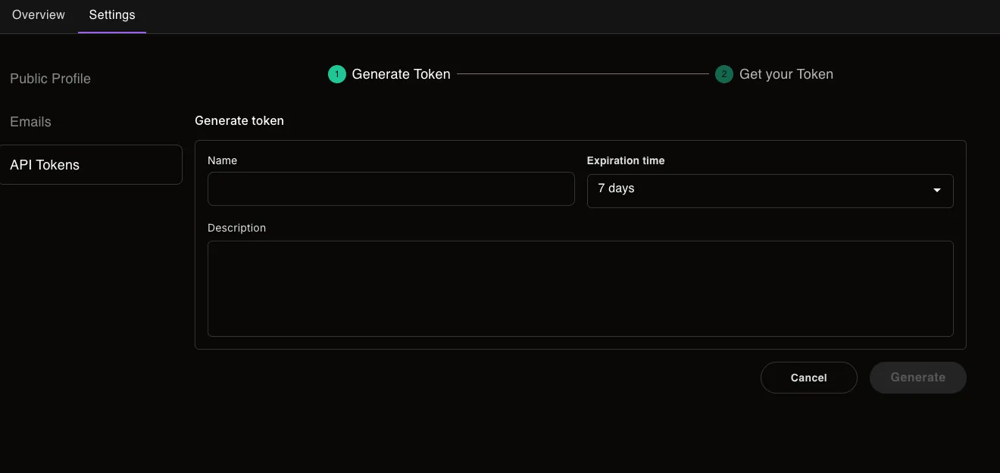

import { Steps } from '@rspress/core/theme';

# CI/CD Integration using Personal token

Integrate Zephyr Cloud into your continuous integration and deployment pipelines to automate your deployment workflow. This guide covers setup for GitHub Actions and GitLab CI/CD.

## Overview

- [Generate API Token](#generate-an-api-token)
- [GitHub Actions Setup](#github-actions)
- [GitLab CI/CD Setup](#gitlab-cicd)
- [Troubleshooting](#troubleshooting)

## Generate an API Token

To use Zephyr Cloud in CI/CD pipelines, you'll need an API token for authentication:

<Steps>
### Click on your avatar
In the upper right you should see your user's avatar with a dropdown menu

### Select My Profile

One of the options in this menu should be "My Profile"

### Select the settings tab

Once on the profile page, select the settings tab from the tab options

### Select API Tokens from the left navigation

On the left hand navigation there should be an option for "API Token" - select this option

### Click Generate Token Button

Fill out the required information about the token you're about to generate



### Click Generate

Copy the token for usage where you need to use it

</Steps>

## GitHub Actions

Zephyr requires an authenticated user to publish updates. Configure your GitHub Actions pipeline to build and deploy with Zephyr by adding a token to your repository secrets.

### Adding the GitHub Secret

1. Create a token on your [API token](https://app.zephyr-cloud.io/profile/settings/user-tokens) page
2. Add it as a repository secret in GitHub
3. The secret must be assigned to the `ZE_SECRET_TOKEN` environment variable

```yml title="pull_request.yml"
env:
  ZE_SECRET_TOKEN: ${{ secrets.ZEPHYR_AUTH_TOKEN }}
```

### Authentication Behavior

When the Zephyr plugin detects the `ZE_SECRET_TOKEN` environment variable, it will automatically authenticate with the Zephyr API, bypassing the usual login step.

You'll see this confirmation in the console:

```shell
 ZEPHYR   Token found in environment. Using secret token for authentication
```

## GitLab CI/CD

Configure your GitLab Runner pipeline to build and deploy with Zephyr by adding a token to the CI/CD variables.

### Adding the GitLab CI/CD Variable

1. Create a full access token on your [API token](https://app.zephyr-cloud.io/profile/settings/user-tokens) page
2. Add it as a CI/CD variable in your GitLab project:

**Steps to add the token:**

1. Navigate to your GitLab project
2. Go to **Settings** → **CI/CD**
3. Expand the **Variables** section
4. Click **Add variable**
5. Configure the variable:
   - **Key**: `ZE_SECRET_TOKEN`
   - **Value**: Your Zephyr API token
   - **Type**: Variable
   - **Environment scope**: All (or specify specific environments)
   - **Protect variable**: ✅ Check if you want to use it only in protected branches
   - **Mask variable**: ✅ Check to hide the value in job logs

### Using the Token in GitLab CI/CD

In your `.gitlab-ci.yml` file, the token will be automatically available as an environment variable:

```yml title=".gitlab-ci.yml"
build:
  stage: build
  script:
    - npm install
    - npm run build
  variables:
    ZE_SECRET_TOKEN: $ZE_SECRET_TOKEN
```

For more explicit control, you can also reference it directly:

```yml title=".gitlab-ci.yml"
deploy:
  stage: deploy
  script:
    - npm install
    - npm run build
  environment:
    name: production
  variables:
    ZE_SECRET_TOKEN: $ZE_SECRET_TOKEN
```

### Authentication Behavior

When the Zephyr plugin detects the `ZE_SECRET_TOKEN` environment variable, it will automatically authenticate with the Zephyr API, bypassing the usual login step.

You'll see this confirmation in the console:

```shell
 ZEPHYR   Token found in environment. Using secret token for authentication
```

### Complete Pipeline Example

Here's a full GitLab CI/CD pipeline configured for Zephyr deployment:

```yml title=".gitlab-ci.yml"
stages:
  - install
  - build
  - deploy

variables:
  npm_config_cache: '$CI_PROJECT_DIR/.npm'

cache:
  key: ${CI_COMMIT_REF_SLUG}
  paths:
    - .npm/
    - node_modules/

install:
  stage: install
  script:
    - npm ci --cache .npm --prefer-offline
  artifacts:
    paths:
      - node_modules/
    expire_in: 1 hour

build:
  stage: build
  script:
    - npm run build
  artifacts:
    paths:
      - dist/
    expire_in: 1 day
  variables:
    ZE_SECRET_TOKEN: $ZE_SECRET_TOKEN

deploy:
  stage: deploy
  script:
    - npm run deploy
  only:
    - main
  environment:
    name: production
  variables:
    ZE_SECRET_TOKEN: $ZE_SECRET_TOKEN
```

## Troubleshooting

### Authentication Issues

**Token not found error:**

- Verify the variable name is exactly `ZE_SECRET_TOKEN`
- Ensure the variable is available in the environment where your job runs
- Check that the token hasn't expired

### GitLab-Specific Issues

**Protected variables:**

- If using protected variables, ensure your pipeline runs on a protected branch or tag

**Masked variables:**

- Masked variables won't appear in job logs (recommended for security)
- Temporarily unmask if you need to troubleshoot, then re-mask for production

**Variable scope:**

- Check that the variable scope matches your pipeline's environment requirements
