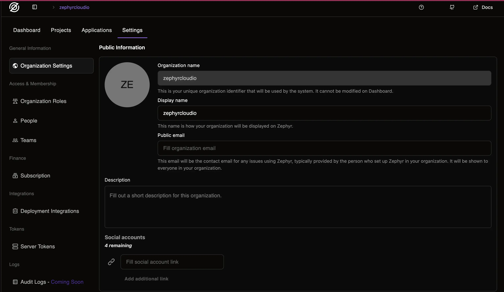
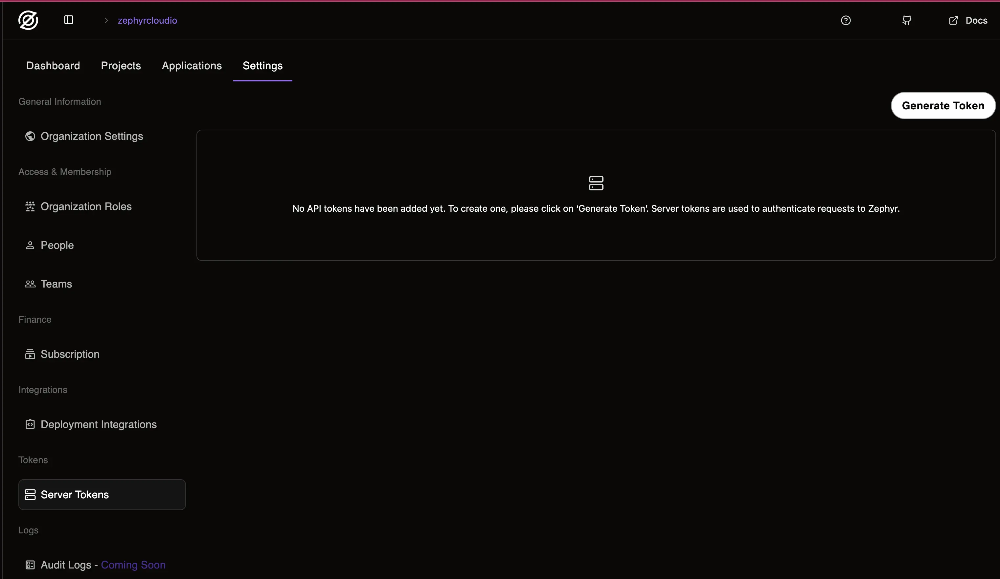
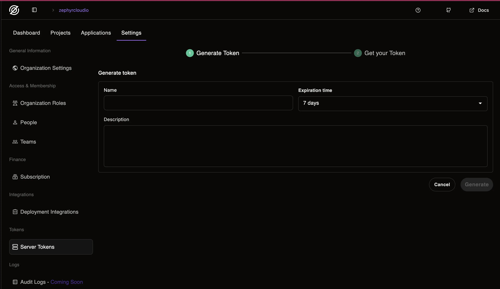
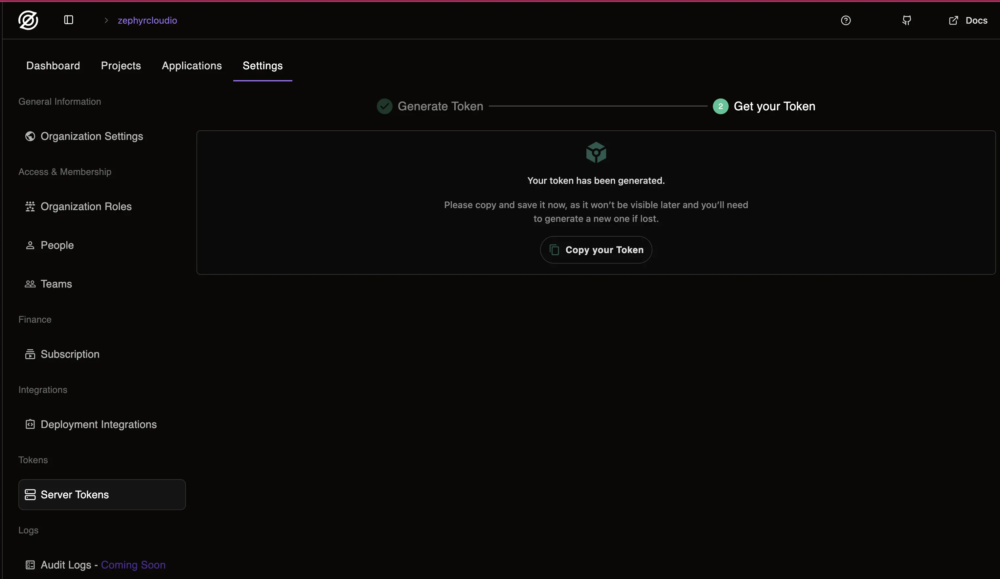

import { Steps } from '@rspress/core/theme';

# CI/CD Integration using Server token

The Server Auth Token allows you to authenticate Zephyr plugins at the organization level without needing individual user credentials for every operation. It identifies the user performing actions via their email and enables secure access to Zephyr on behalf of your organization.

## Overview

- [Generate API Token](#generate-an-server-api-token)
- [GitHub Actions Setup](#github-actions)
- [GitLab CI/CD Setup](#gitlab-cicd)
- [Troubleshooting](#troubleshooting)

## Generate an Server API Token

To use Zephyr Cloud in CI/CD pipelines, you'll need an API token for authentication:

<Steps>
### Organization Settings

Go to your Organization Settings in Zephyr.



### Server Tokens section

Navigate to the Server Tokens section.



### Click Generate Token Button

Fill out the required information about the token you're about to generate



### Click Generate

Copy the token for usage where you need to use it



</Steps>

## GitHub Actions

Zephyr requires an authenticated user to publish updates. Configure your GitHub Actions pipeline to build and deploy with Zephyr by adding a token to your repository secrets.

### Adding the GitHub Secret

1. Create a token on your organization settings page
2. Add it as a repository secret in GitHub
3. The secret must be assigned to the `ZE_SERVER_TOKEN` environment variable
4. Set user email

```yml title="pull_request.yml"
env:
  ZE_SERVER_TOKEN: ${{ secrets.ZEPHYR_AUTH_TOKEN }}
  ZE_USER_EMAIL: <User Email>
```

### Authentication Behavior

When the Zephyr plugin detects the `ZE_SERVER_TOKEN` environment variable, it will automatically authenticate with the Zephyr API, bypassing the usual login step.
The Zephyr needs a user email to identify who is performing builds. You can provide it in one of two ways:

- Automatically from Git config
- Manually via environment variable `ZE_USER_EMAIL`

You'll see this confirmation in the console:

```shell
 ZEPHYR   Token found in environment. Using secret token for authentication.
```

## GitLab CI/CD

Configure your GitLab Runner pipeline to build and deploy with Zephyr by adding a token to the CI/CD variables.

### Adding the GitLab CI/CD Variable

1. Create a full access token on your [Organization Server tokens page](#server-tokens-section) page
2. Add it as a CI/CD variable in your GitLab project:

**Steps to add the token:**

1. Navigate to your GitLab project
2. Go to **Settings** → **CI/CD**
3. Expand the **Variables** section
4. Click **Add variable**
5. Configure the variable:
   - **Key**: `ZE_SERVER_TOKEN`
   - **Key**: `ZE_USER_EMAIL`
   - **Value**: Your Zephyr API token
   - **Type**: Variable
   - **Environment scope**: All (or specify specific environments)
   - **Protect variable**: ✅ Check if you want to use it only in protected branches
   - **Mask variable**: ✅ Check to hide the value in job logs

### Using the Token in GitLab CI/CD

In your `.gitlab-ci.yml` file, the token will be automatically available as an environment variable:

```yml title=".gitlab-ci.yml"
build:
  stage: build
  script:
    - npm install
    - npm run build
  variables:
    ZE_SERVER_TOKEN: $ZE_SERVER_TOKEN
    ZE_USER_EMAIL: $ZE_USER_EMAIL
```

For more explicit control, you can also reference it directly:

```yml title=".gitlab-ci.yml"
deploy:
  stage: deploy
  script:
    - npm install
    - npm run build
  environment:
    name: production
  variables:
    ZE_SERVER_TOKEN: $ZE_SERVER_TOKEN
    ZE_USER_EMAIL: $ZE_USER_EMAIL
```

### Authentication Behavior

When the Zephyr plugin detects the `ZE_SERVER_TOKEN` environment variable, it will automatically authenticate with the Zephyr API, bypassing the usual login step.

You'll see this confirmation in the console:

```shell
 ZEPHYR   Token found in environment. Using secret token for authentication
```

### Complete Pipeline Example

Here's a full GitLab CI/CD pipeline configured for Zephyr deployment:

```yml title=".gitlab-ci.yml"
stages:
  - install
  - build
  - deploy

variables:
  npm_config_cache: '$CI_PROJECT_DIR/.npm'

cache:
  key: ${CI_COMMIT_REF_SLUG}
  paths:
    - .npm/
    - node_modules/

install:
  stage: install
  script:
    - npm ci --cache .npm --prefer-offline
  artifacts:
    paths:
      - node_modules/
    expire_in: 1 hour

build:
  stage: build
  script:
    - npm run build
  artifacts:
    paths:
      - dist/
    expire_in: 1 day
  variables:
    ZE_SERVER_TOKEN: $ZE_SERVER_TOKEN
    ZE_USER_EMAIL: $ZE_USER_EMAIL

deploy:
  stage: deploy
  script:
    - npm run deploy
  only:
    - main
  environment:
    name: production
  variables:
    ZE_SERVER_TOKEN: $ZE_SERVER_TOKEN
    ZE_USER_EMAIL: $ZE_USER_EMAIL
```

## Security Notes

- Do not share server tokens publicly.
- Rotate tokens regularly and revoke any that may be compromised.
- Remember: server tokens provide organization-level access, so they are sensitive credentials.

## Troubleshooting

### Authentication Issues

**Token not found error:**

- Verify the variables names are exactly `ZE_SERVER_TOKEN` and `ZE_USER_EMAIL`
- Ensure the variables are available in the environment where your job runs
- Check that the token hasn't expired

### GitLab-Specific Issues

**Protected variables:**

- If using protected variables, ensure your pipeline runs on a protected branch or tag

**Masked variables:**

- Masked variables won't appear in job logs (recommended for security)
- Temporarily unmask if you need to troubleshoot, then re-mask for production

**Variable scope:**

- Check that the variable scope matches your pipeline's environment requirements
