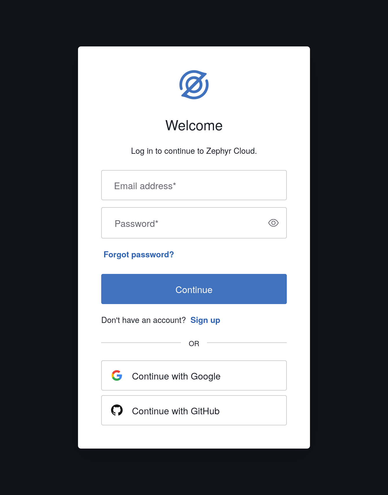
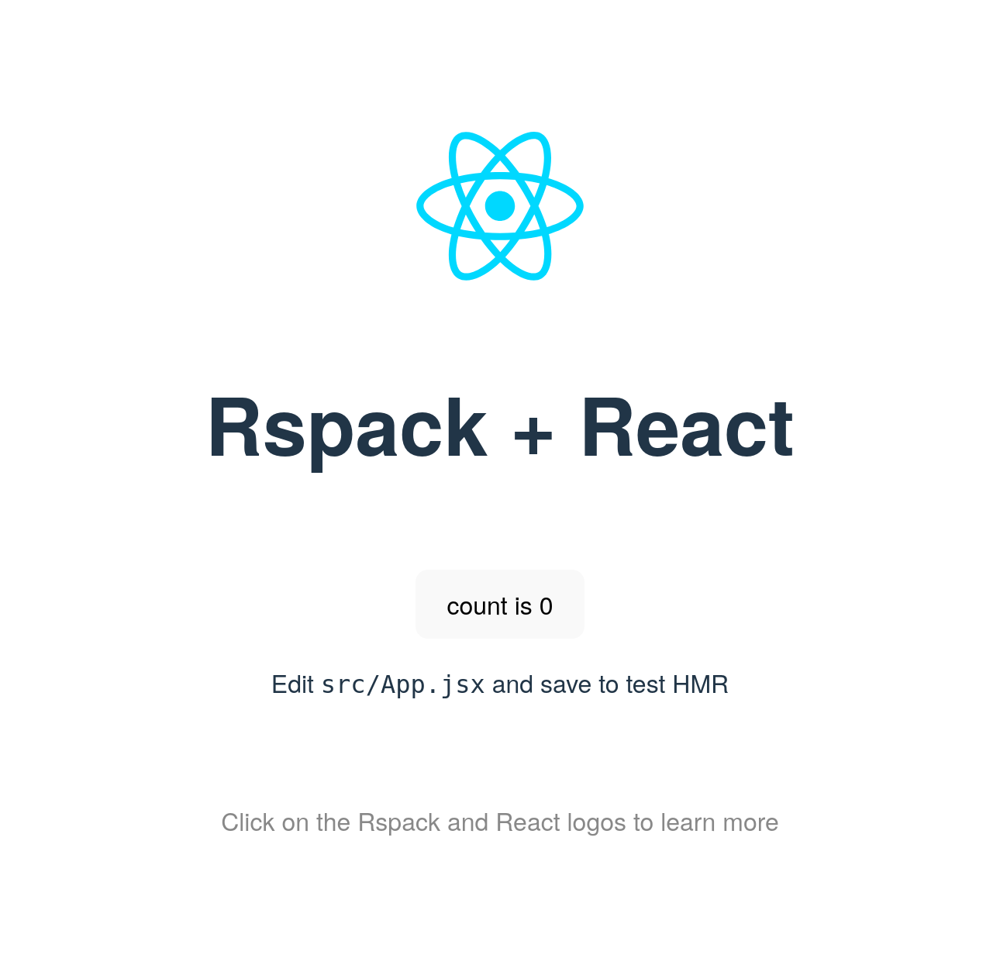

import { Steps, Button, PackageManagerTabs, SourceCode } from "@theme";
import { Keyboard } from "../../../components/ui/keyboard"

# Create and deploy a basic application
In this tutorial, we'll create a React application and deploy it to Zephyr Cloud.

Before we start this tutorial, ensure that you have:

*   A working installation of Node.js.
*   A working installation of pnpm.
*   A GitHub account and a working Git installation.
*   A working installation of Google Chrome.

---

<Steps>
### Sign up for a Zephyr Cloud account

<div class="rspress-directive note">
    <div class="rspress-directive-title">NOTE</div>
    <div class="rspress-directive-content">
        <p>If you already have a Zephyr Cloud account, you can skip this step and continue with <strong><a href="#create-a-boilerplate-react-application">Create a boilerplate React application</a></strong>.</p>
    </div>
</div>

Before we create and deploy our application, we need to create a Zephyr Cloud account.

<Button
    text="Open the Zephyr Cloud Dashboard"
    href="https://app.zephyr-cloud.io"
    size="medium"
    external="true"
/>



We can choose to create a Zephyr Cloud account by authenticating with Google, GitHub, or by email.
To sign up using your email address, click **Sign up** and follow the instructions.

### Create a boilerplate React application
Rspack is a webpack-compatible bundler supported by Zephyr Cloud.
We'll use.

```shell
pnpm create rspack@latest
```

The command will take us through the necessary prompts to generate a new application.

Type "y" and press <Keyboard shortcuts="Enter"/>.
Our package manager will download the necessary packages to run the creation utility.
Once that process finishes, we'll be prompted for a project folder.

```console
? Project folder › zephyr-cloud-example
```

Enter `zephyr-cloud-example` and press <Keyboard shortcuts="Enter"/>.
We'll be prompted for.

```console
? Project template › - Use arrow-keys. Return to submit.
❯   react
    react-ts
    vue
    vue-ts
```

Ensure the "react" option is highlighted in your terminal and press <Keyboard shortcuts="Enter"/>.
Let's change directory to our new React application and pull it's dependencies from npm.

```shell
cd zephyr-cloud-example && pnpm install
```

Finally, let's verify that our application runs locally.

```shell
pnpm run dev
```

After running the command, we'll see this line printed to our terminal followed by a URL to access our application.

```console
<i> [webpack-dev-server] Project is running at:
```

After visiting the URL in our web browser, we'll see the following page:



After verifying that our application runs, switch back to our terminal and press <Keyboard shortcuts={["Ctrl", "C"]}/> to stop the server.

### Install the Zephyr Cloud bundler plugin
Zephyr Cloud deployment happens as part of our application's bundling process.
As we're using Rspack in this tutorial, we can leverage the Zephyr Cloud webpack plugin.

Let's install the plugin and save it to our application's dependencies.

```shell
pnpm install zephyr-webpack-plugin --save
```

The next step is to add the Zephyr Cloud webpack plugin to the end of webpack's plugin chain.
Let's start by importing the webpack plugin in our application's `rspack.config.mjs`:

```js filename="rspack.config.mjs"
import { dirname } from "node:path";
import { fileURLToPath } from "node:url";
import { defineConfig } from "@rspack/cli";
import { rspack } from "@rspack/core";
import RefreshPlugin from "@rspack/plugin-react-refresh";
import { withZephyr } from "zephyr-webpack-plugin"; // added
```

Lastly, let's replace the `defineConfig()` call in `rspack.config.mjs` with a call to `withZephyr()`.
The default export should look like this, with the pre-existing Rspack configuration object passed through.

```js filename="rspack.config.mjs"
export default withZephyr()({
    context: __dirname,
    entry: {
        main: "./src/main.jsx"
    },
    // Remaining Rspack configuration
});
```

### Push the application to a new GitHub repository
Zephyr Cloud requires our application to have a Git repository.
The platform uses Git metadata to identify our application and it's associated deployments.

<Button
    text="Create a GitHub repository"
    href="https://github.com/new?name=zephyr-cloud-example"
    size="medium"
    external="true"
/>

After creating the repository, we need to initialize a Git repository locally and push our application.

```shell
git init
```

After it's initialized, let's add all of our application's files to the repository and commit them to our local `main` branch.

```shell
git add . &&
git commit -m "Initial commit" &&
git branch -M main
```

Finally, let's add our GitHub repository as a remote and push our application.
Replace `USERNAME` with your GitHub username.

```shell
git remote add origin git@github.com:USERNAME/zephyr-cloud-example.git &&
git push -u origin main
```

### Run the development server
Let's run our development server again and observe what happens.

```shell
pnpm run dev
```

Our web browser will open with a Zephyr Cloud authorization page.
Once authorized, switch back to our terminal.
Notice that in addition to the local URLs we saw when we ran this command previously, there's additional output relating to Zephyr Cloud.

The first line shows that a local snapshot of our application was successfully uploaded to Zephyr Cloud.

```console
[zephyr]: [zephyr-cloud-example.zephyr-cloud-example.GIT_USERNAME](ZC_USERNAME)[9]: uploaded local snapshot in 227ms
```

Later in the output, we'll notice four URLs are printed to the terminal.
If we visit one of these URLs, we can see our build deployed live.

Keep the development server running for the next step.

### Modify and redeploy the application
Now that we have a first build of our application deployed to Zephyr Cloud, let's see what happens when we modify our code.

Let's replace the "React + Rspack" heading with "Hello, Zephyr Cloud!" by editing `./src/App.jsx`.

```jsx title="./src/App.jsx"
<h1>Hello, Zephyr Cloud!</h1>
```

Switch back to our terminal to check the output from the development server.
We'll see that the server picked up on the changes, rebuilt our application, and deployed a new snapshot to Zephyr Cloud.

When we visit a URL output by the Zephyr Cloud bundler plugin, we can observe that the heading changed as expected.

### Explore deployments with Zephyr Mission Control
Now that we've deployed our application twice to Zephyr Cloud, let's explore our deployments via the Zephyr Mission Control browser extension.

Open a new tab in Google Chrome and open the [Zephyr Mission Control extension][extension] on the Chrome Web Store.
Click the **Add to Chrome** button, and click **Add extension** when prompted.

Click the **Extensions** button to the right of the address bar.
In the dialog presented, click the Pin button next to Zephyr Mission Control.

For the first run, we need to right click the Zephyr Mission Control button to the right of the address bar.
In the context menu, click the **Open side panel** button.
We'll see a new side panel containing a Login button.
Click the button and authenticate with our Zephyr Cloud account.

In the side panel, click the Applicatins dropdown and select `zephyr-cloud-example`.
Notice that the latest version of our deployment is automatically loaded in the current tab.

In the side panel, let's try toggling between versions.
Click the Versions dropdown menu and select a previous version of our application.

We'll see that the deployment shown in the browser is reflective of the version we chose in the side panel.

</Steps>

Now that we have a better understanding of how the Zephyr Cloud platform works, we can start deploying other applications.
To learn how to integrate Zephyr Cloud with your existing applications, read:

*   [Deploying with Rspack][howto-rspack]
*   [Deploying with webpack][howto-webpack]
*   [Deploying with Vite][howto-vite]

For more information about the browser extension, see:

*   [Using the browser extension][howto-extension]

[rspack]: https://www.rspack.dev/
[extension]: https://chromewebstore.google.com/detail/zephyr-mission-control/liflhldchhinbaeplljlplhnbkdidedn
[howto-rspack]: /guide/how-to/deploying-with-rspack
[howto-webpack]: /guide/how-to/deploying-with-webpack
[howto-vite]: /guide/how-to/deploying-with-vite
[howto-extension]: /guide/how-to/using-the-browser-extension